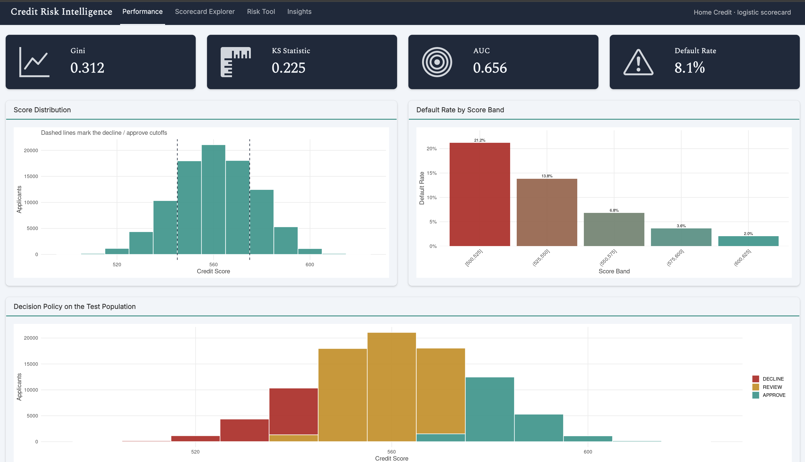
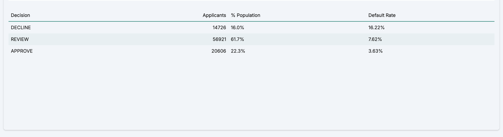
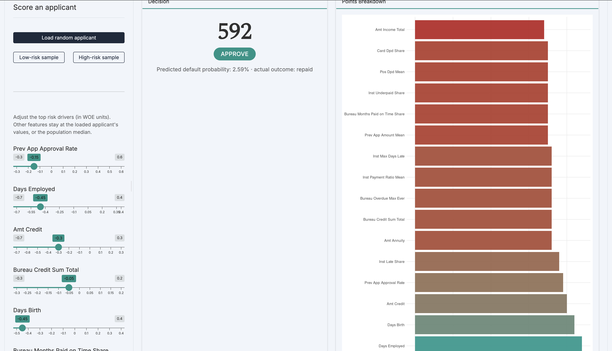
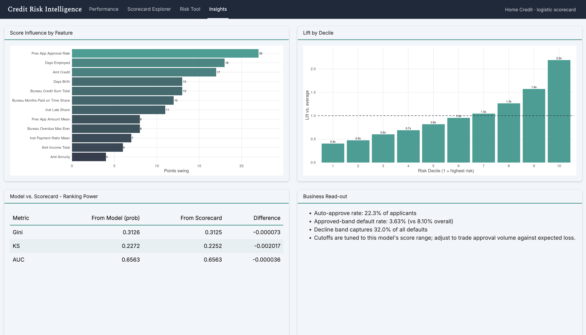

# Credit Risk Intelligence Platform

An end-to-end credit risk modeling project built on the Home Credit Default Risk dataset. The project covers the complete workflow from SQL-based feature engineering on 58M+ records through scorecard development, model validation, and deployment in an interactive Shiny dashboard.

**[▶ Live dashboard](https://nihirasharma.shinyapps.io/credit-risk-intelligence-platform/)** &nbsp;·&nbsp; **[Methodology](docs/METHODOLOGY.md)** &nbsp;·&nbsp; **[Model comparison](docs/MODEL_COMPARISON.md)**

> Built using R, PostgreSQL, tidyverse, scorecard, xgboost and Shiny.




---

## Project Overview

This project demonstrates a complete credit risk analytics pipeline similar to those used in financial institutions.

The workflow includes:

- Building an analytics dataset from multiple raw relational tables
- Feature engineering using SQL
- Weight of Evidence (WOE) transformation and Information Value (IV) feature selection
- Logistic regression and XGBoost model development
- Credit scorecard generation
- Decision strategy development
- Model validation
- Interactive dashboard deployment

The focus of this project is building a **transparent, interpretable and production-oriented** credit scoring solution rather than simply maximizing predictive performance. On clean Home Credit data with no leakage, a Gini around 0.31 is the realistic ceiling. Inflated scores on this dataset typically indicate look-ahead bias.

---

## Key Results

|                          |                                                       |
| ------------------------ | ----------------------------------------------------- |
| **Dataset**              | 307,511 applicants from 58M+ raw records           |
| **Final Model**          | Logistic Regression (16 variables)                    |
| **Performance**          | AUC 0.66 · Gini 0.31 · KS 0.23                        |
| **Calibration**          | MSE 0.0001 (predicted rates track observed)           |
| **Population Stability** | Train→test PSI ≈ 0 (stable across samples)                       |
| **Decision Strategy**    | 22% automatically approved at a 3.6% default rate vs 8.1% overall |
| **Fairness Assessment**  | Evaluated across gender and age groups – no added disparity beyond base rates |
| **Database**             | PostgreSQL feature engineering across 7 source tables |
| **Testing**              | 28 automated tests (testthat)                         |

---

## Interactive Dashboard

The project is deployed as an interactive Shiny app ([live here](https://nihirasharma.shinyapps.io/credit-risk-intelligence-platform/)) with four pages:

### Performance

- Model metrics
- Score distribution
- Approval policy
- Default rate by score band

### Scorecard Explorer

- Browse every variable
- Inspect scorecard bins
- Review assigned points

### Risk Tool

- Score individual applicants
- View points breakdown
- Explore the impact of changing applicant characteristics

### Insights

- Feature importance
- Lift analysis
- Model vs scorecard comparison
- Business summary

**Risk Tool:** 


**Insights:** 


*Hosted on shinyapps.io free tier – the app sleeps when idle and takes a few seconds to wake on first visit.*

---

## Project Pipeline

```
Raw Home Credit Tables  (7 tables, 58M+ rows)
        │
        ▼
PostgreSQL Feature Engineering
        │
        ▼
Analytics Dataset  (307,511 applicants × ~100 features)
        │
        ▼
WOE Transformation & IV Selection (22 features)
        │
        ▼
Logistic Regression (16 features after dropping collinear) + XGBoost Benchmark
        │
        ▼
Credit Scorecard Generation  (PDO scaling)
        │
        ▼
Model Validation  (ROC · calibration · PSI · fairness)
        │
        ▼
Interactive Shiny Dashboard
```

---

## Project Notebooks

The complete workflow is documented through rendered HTML notebooks, viewable in the browser via GitHub Pages.

* [01 – Exploratory Data Analysis](https://nihira11.github.io/credit-risk-intelligence-platform/notebooks/01_eda.html)
* [02 – Feature Selection (WOE & IV)](https://nihira11.github.io/credit-risk-intelligence-platform/notebooks/02_feature_selection.html)
* [03 – Model Development](https://nihira11.github.io/credit-risk-intelligence-platform/notebooks/03_modeling.html)
* [04 – Scorecard Generation](https://nihira11.github.io/credit-risk-intelligence-platform/notebooks/04_scorecard_generation.html)
* [05 – Model Validation](https://nihira11.github.io/credit-risk-intelligence-platform/notebooks/05_model_validation.html)

---

## Model Selection

Both Logistic Regression and XGBoost were developed and compared.

Although XGBoost achieved slightly higher predictive performance (~0.01 Gini on test), it also overfit more (train Gini 0.38 vs test 0.32). Logistic Regression was selected as the final production model because it provides:

- Complete interpretability
- Stable performance
- Monotonic risk relationships
- Direct scorecard generation
- Regulatory transparency

A detailed comparison is available in **[MODEL_COMPARISON.md](docs/MODEL_COMPARISON.md)**.

---

## Validation

The model is validated the way a model-risk function would review it before sign-off:

- **Discrimination** – ROC curve, Gini, KS, AUC on held-out test data
- **Calibration** – predicted default probabilities track observed rates (MSE 0.0001)
- **Stability** – Population Stability Index between train and test samples
- **Fairness** – predicted risk screened across gender and age bands, confirming the model reflects observed base rates rather than adding disparity

---

## Tech Stack

|                          |                                                       |
| ------------------------ | ----------------------------------------------------- |
| **Database**      | PostgreSQL           |
| **Programming**   | R                    |
| **Wrangling**     | Tidyverse            |
| **Modeling**      | glm · scorecard · xgboost · caret           |
| **Dashboard**     | Shiny · bslib        |
| **Testing**       | testthat             |


---

## Repository structure

```
credit-risk-intelligence-platform/
│
├── data/
│   ├── raw/                                # original Home Credit dataset (not tracked)
│   └── processed/                          # processed datasets and WOE-transformed data
│
├── docs/                                   # project documentation and technical reports
│   ├── FEATURE_DEFINITIONS.md              # data dictionary and engineered feature descriptions
│   ├── METHODOLOGY.md                      # end-to-end project methodology
│   └── MODEL_COMPARISON.md                 # logistic Regression vs XGBoost comparison
│
├── notebooks/                              # complete modelling workflow
│   ├── 01_eda.Rmd / .html                  # exploratory Data Analysis
│   ├── 02_feature_selection.Rmd / .html    # WOE transformation & IV feature selection
│   ├── 03_modeling.Rmd / .html             # logistic regression & XGBoost modelling
│   ├── 04_scorecard_generation.Rmd / .html # credit scorecard construction
│   └── 05_model_validation.Rmd / .html     # model evaluation, calibration & fairness
│
├── outputs/                                # exported model results and business artefacts
│   ├── *.csv                               # validation metrics, scorecard tables and summaries
│   └── *.rds                               # saved model objects (ignored in Git)
│
├── screenshots/                            # dashboard screenshots used in the README
│   ├── dashboard_performance.png
│   ├── scorecard.png
│   ├── risk_tool.png
│   ├── risk_decline.png
│   └── insights.png
│
├── R/                                      # reusable project functions
│   ├── db_connection.R                     # PostgreSQL connection utilities
│   ├── inspect_files.R                     # data inspection helpers
│   ├── model_utils.R                       # feature engineering and modelling utilities
│   └── scorecard.R                         # scorecard generation functions
│
├── scorecard_output/
│   └── test_scored.csv                     # example scored applicant dataset
│
├── shiny_app/                              # interactive Shiny dashboard
│   ├── app.R                               # app entry point
│   ├── pages/                              # dashboard pages
│   ├── data/                               # dashboard datasets and scorecard objects
│   └── www/                                # CSS and static assets
│
├── sql/                                    # database schema and feature engineering
│   ├── 01_create_tables.sql                # creates database tables
│   └── 02_feature_engineering.sql          # builds analytics dataset
│
├── tests/                                  # unit tests
│   ├── test_features.R                     # feature engineering tests
│   └── test_scorecard.R                    # scorecard validation tests
│
├── .gitignore
├── README.md                               # project overview
├── requirements.R                          # required R packages
└── credit-risk-intelligence-platform.Rproj
```
---

## Running the Project

1. Download the [Home Credit Default Risk](https://www.kaggle.com/c/home-credit-default-risk) dataset into `data/raw/`.
2. Import the raw CSV files into PostgreSQL.
3. Execute `sql/01_create_tables.sql` then `sql/02_feature_engineering.sql` to generate the analytics dataset.
4. Render the notebooks 01–05 in sequence (from the project root).
5. Launch the Shiny dashboard with `shiny::runApp("shiny_app")`.

Refer to **[METHODOLOGY.md](docs/METHODOLOGY.md)** for the complete workflow and implementation details.

---

*Built by Nihira Sharma. Dataset: Home Credit Default Risk (Kaggle).*